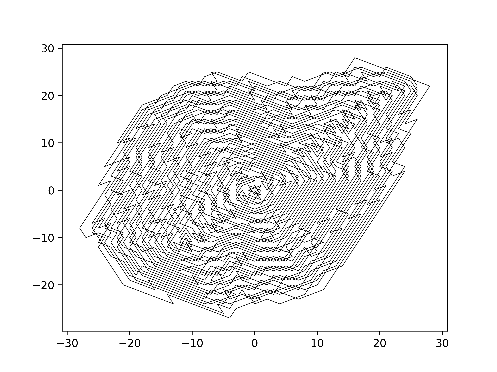

# trapped-knight
> A mathematical problem of a chess knight moving on a infinite chess board




## Motivation
After seeing the problem in the [the Numberphile video](https://www.youtube.com/watch?v=RGQe8waGJ4w) I liked the pattern a lot and decided to implement it in python to create myself a more personal version of the graph.

## Problem definition:
Given is a infinite chess board enumerated in a spiral:
```
      .
5 4 3 .
6 1 2 .
7 8 9 10

```

Now, place a knight on the square that contains the smallest number (here 1). The knight can move (following the typical chess rules), but he also has to go to the field with the smallest number, where he hasn't been before. When there are no more squares remaining, the sequence terminates.

## The sequence 
The sequence is finite and ends after 2016 steps with the number 2084. The OEIS-ID is [A316667](https://oeis.org/A316667)
